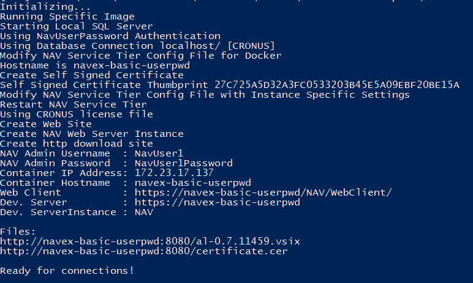
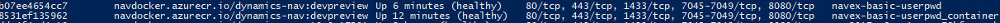
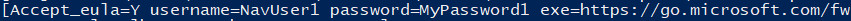

# Examples and use-cases for MS Dynamics NAV on Docker

## BASIC EXAMPLE + USER & PASSWORD

This is a bit more advanced example but still very simple one. You specify **user name**, **user password** (these won\`t be generated by the container itself) and something more but still, the amount of the parameters is very limited.

Let\`s review the specific parameters we use in this example (by default we will be talking about `run.ps1`):
- `--name=navex-basic-userpwd_container` - This parameter sets the name of the container you about to create. Keep in mind the container names must be unique on one docker host (you can\`t create two containers with the same name; you need to kill the first one using `docker rm [container_name]` / `docker rm -f [container_name]` and then you can create the second one).
    
    **Note:**
    `run.inputPwd.ps1` defines `$hostname` and use it later to set `--name` parameter, as well as `--hostname` parameter. This means **container hostname** = **container name**.

- `--hostname=navex-basic-userpwd` - Hostname of the container. 

- `-e "username=NavUser1"` - Required in this example. Name of the NAV user specified by *you*.

- `-e "password=NavUser1Password"` - Required in this example. Again, *you* specify the password for the NAV user.

	**Note:**
	The password will be passed as a plain text. Anyone with access to the Docker API can reveal it using `docker inspect [container_name]` at any moment (even if the container has been stopped but not removed).	
    
    You can see there are two examples:
    - `run.ps1` - The default one with everything (pwd) included in the file.
    - `run.inputPwd.ps1` - We can consider this variant a little bit better as the password insn\`t included in the file and you need to present it when running the script. 
    
    `docker inspect [container_name]` still reveal the password in both cases!!!

- Output of the `run.ps1`

- Output of the `run.inputPwd.ps1`

    -   You can see the password is being displayed on the screen so the purpose of the input dialog is very limited. The password is not being stored on the docker host but still you can see it in the log. Maybe this could be changed [Issue #7](https://github.com/Microsoft/nav-docker/issues/7).

- `docker ps` displays both containers. Both of the are running and can coexist because the container names are different.

# !!! How can be revealed the password value !!!

- Output of the container.

    - Of course, you can run any container in a detached mode but still you can use `docker logs [container_name]`. This command will output the log so you can see the same data you can see in the *interactive* mode.

- You can run `docker inspect [container_name]` which displays a *JSON* string with lot of metadata describing the container. All input parameters are included!!!

    - The following displays only **env** variables (this is where the pwd is being stored): `docker inspect --format '{{ index .Config.Env }}' navex-basic-userpwd`

    
