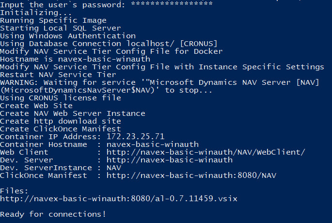
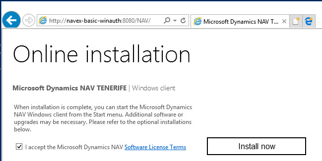
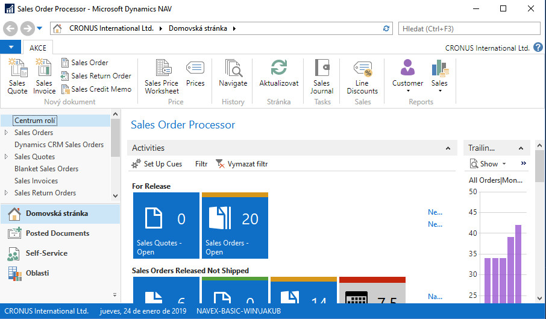
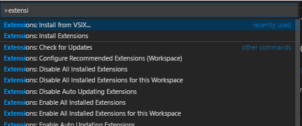
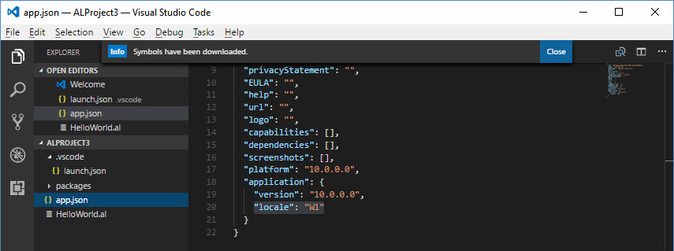
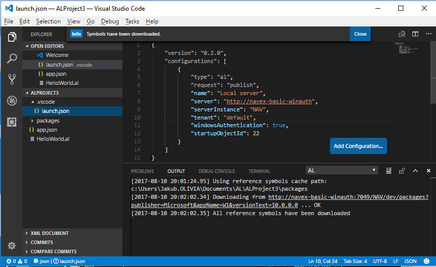

# Examples and use-cases for MS Dynamics NAV on Docker

## SHARED WINDOWS AUTHENTICATION + CLICKONCE + VISUAL STUDIO CODE

In this case, we will describe a simple solution from the Docker perspective. Our command `docker run` will be pretty straightforward and if you passed through the previous examples you will have no problem to understand and achieve same results as I do.

Let\`s say a word about the **Windows authentication** for **Windows Containers**. Containers **by default** don\`t provide mechanisms that will enable real Windows authentication for domain users. This means you can\`t specify domain accounts for the services (for example) running inside the containers. And in a very similar way, you can\`t authenticate yourself using your domain account against the services and solutions running inside the containers.

As I have already mentioned - this behavior comes by default. But you have two options how to solve WinAuth problem:

- You can provide your credentials explicitly (pass your windows credentials into the container) and benefit from the fact that Windows will authenticate you correctly even in the case you are on the domain (your Docker host) and the container has its own workgroup inside.
You can see that the solution we have just mentioned improves somehow our possibilities, it is the easy-to-achieve solution. 

    ~~On the other hand, we still need to provide our credentials and those can be revealed using the techniques mentioned in the previous example.~~

    Here we need to mention a really [nice contribution](https://github.com/Microsoft/nav-docker/pull/76) from [Michael Megel](https://www.linkedin.com/in/michaelmegel/). This is a real game changer that improves the security of your password. He use secure password string in combination with a cryptographic key. The encrypted password is being sent via an **env** parameter into the container and the **key** is being sent into the container as a **file**. In the container he uses the **key** to decrypt the **encrypted password** and delete the key file. If anyone fires `docker inspect [container_name]` he won\`t see anymore your password in a plain text. Instead the encrypted password will appear. Really nice solution and many thanks to [Michael Megel](https://www.linkedin.com/in/michaelmegel/)!!!

    I need to say that I was a bit sceptic at the very first moment because you could pass your password directly via the file (as he does with the **key**) and delete it once received by the container (again, the **key** is being deleted when retrieved inside the container). But now I can see there is one advantage - you split your security information into two separate pieces. Each of them is useless without the pair information. It is still possible to hack a password being passed in this way but it would be more complicated to hack it. Michael, sorry that I was so blind at the very first moments!!!

    Here, in the example, the key uses 16 randomly generated bytes and is being sored here: `$KeyFile = ".\my\myAES.key"`. This file will be mapped into the container once the container has been initialized.

- You can use [gMSA](https://technet.microsoft.com/en-us/library/jj128431(v=ws.11).aspx) and solve the integration with the domain properly. Unfortunately, this is not so easy to achieve. There are few prerequisites you must fulfill. One of them, and this one is the key one, goes against your **Domain Controller**. **"The Active Directory schema in the gMSA domain’s forest needs to be updated to Windows Server 2012 to create a gMSA."** I can see this requirement can be a real problem for some partners. An even worse situation can be seen in the case of the partners\` customers. There are many companies with the domain\`s forest on the 2003 level. As the objective of the example is the previous (the less secure one) solution we won\`t discuss any other details related to **gMSA** right now. There will be one or more examples focused on the **gMSA** solution.

### Specific `docker run` parameters in the example are:

- `-e Auth=Windows` - Required in this example. Alternatively, you can also use `-e WindowsAuth=Y` to achieve the same - setting the container (NAV services) to work in Windows Authentication mode.

- `-e username=$env:USERNAME` - Required in this example. `$env:USERNAME` will automatically set your Windows user account (**without** the domain name part, this is very important).

- `-e securePassword=$passsec` - Required in this example. Your encrypted password for the provided user account. The password (before it is being encrypted) must match with your Windows account password!!! You can see we use different approach that was demonstrated in the [previous example](../basic_userpwd) (in the second variant). This newer alternative is much better in terms of security (you split the password into two pieces and each of them is being transfered in a different way; one of them will be deleted once the original password will be restored in the container and the second one itself will remain uselless to anyone without the deleted part).

- `-v $PSScriptRoot\my:c:\run\my` - Required in this example. The shared folder will be used to pass the **cryptographic key** into the container.

- `-e passwordKeyFile='c:\run\my\myAES.key'` - Required in this example. The path and the name of the **cryptographic key** that will be used to encrypt the password inside the container. This file will be automatically deleted (you can eventually suppress the deletion using `-e RemovePasswordKeyFile=Y`).

- `-e clickonce=Y` - The container will create and publish **ClickOnce** package. This gives us the possibility to access NAV using Windows Client (aka RTC) and access natively using our Windows credentials.

---

## The output of the `run.ps1` script:

We can see that there is no information about the user (user name and user password are not present).

## CLICKONCE

You can see there is a new link to download "ClickOnce Manifest". Use the link, open the web page and download the manifest clicking on **Install now**.

Run the manifest. After that, you should be able to see running RTC (no password will be required).

**Note:**
If you are using Google Chrome (I usually do) and see some security errors when downloading and/or running the manifest, I would recommend for example **Internet Explorer** or **Edge**. Both of them work fine for my (I don\`t use *recommended settings* in IE).

## VISUAL STUDIO CODE - INSTALL THE EXTENSION / PLUGIN:

I suppose you have [Visual Studio Code](https://code.visualstudio.com/) already installed and have some experience with it.

Probably you have already mentioned there is one link in the *container output table* with the extension **vsix**. This is the extension you need to add into your *VS Code*.

Before you install the extension the **vsix** file should be downloaded. Once you have downloaded your file, go to *VS Code*, run **Command Palette** (*Ctrl + Shift + P*) and run `Extensions: Install from VSIX...`:

Then you select the **vsix** file you have previously downloaded and you ready to start with development :)

**Note:**
You can eventually download the **vsix** file directly from *VS Code* in the same dialog you specify the **vsix** file. Just put the link instead of any file and the file will be downloaded and installed. It is probably the easiest way but maybe a bit less transparent than the previous one.

## VISUAL STUDIO CODE - SETUP THE PROJECT:

You can use any of the sample projects you can find online (for example). You can create an empty project and this is exactly I am going to describe here.

- Run *Ctrl + Shift + P* and run `AL: Go!` command. This will create a new project with all required files.

- Change `locale` property in `app.json` file. Switch from **US** to **W1**:

    

- Configure `launch.json` file to point to your instance running inside the container (use **Dev. Server** property`s value from the *container output table*):

    

Now you just click on **Download Symbols**, wait a while until the download is finished. And now you can start with your development, you have everything ready to go!!!