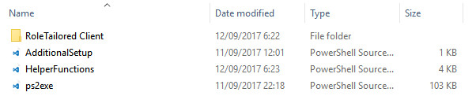
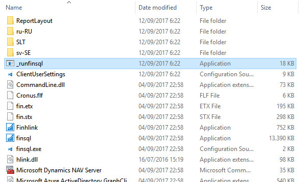
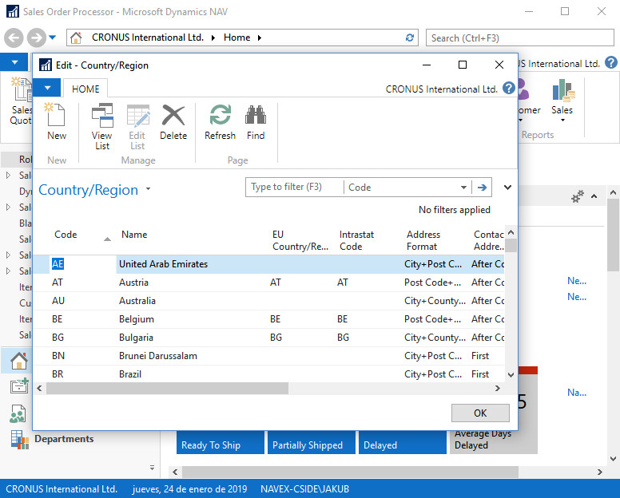

# Examples and use-cases for MS Dynamics NAV on Docker

## COPY C/SIDE TO BE ABLE RUN TABLE SYNCHRONIZATION

This approach aims to solve the problem of the table synchronization in the case you are using *Windows credential mapping hack*. In this particular case you can\`t use *C/SIDE* distributed via *ClickOnce* to sync tables without *gMSA* to achieve schema synchronization.

We will actually copy the content of the *RoleTailored Client* folder back into the host system. Then we will be able to open NAV from the locally provided *C/SIDE* and also sync schema of the tables correctly.

You can see the next overrides here in this example. There are two standard files being overridden (in the folder `my`):
- `AdditionalSetup.ps1` - This one executes `Export-ClientFolder` function defined in the following file.
- `HelperFunctions.ps1` - You can see I add two new functions here. `Export-ClientFolder` copies the content of *RoleTailored Client* folder down to your *docker host*. It also `ClientUserSettings.config` file properly configured to be able to run objects directly from *C/SIDE*. The second function called `New-FinSqlExeRunner` creates an executable that will be copied to the same folder. This new `_runfinsql.exe` file will let you run *C/SIDE* with all required parameters (you won\`t need to configure *C/SIDE* parameters like *server name*, *server instance*, *database name* etc.).

---
## This solution is **Running C/SIDE and AL Side-by-Side** aware and it will let you run new NAV versions (since November update) side by side.
---
### Specific `docker run` parameters in the example are:

- `-v $PSScriptRoot\my:c:\run\my ` - Required in this example. Specifies the definition of the Docker mount. In this way, you activate the override mechanism.

- `-e Auth=Windows` - Required in this example. Was described in the previous examples.

- `-e username=$env:USERNAME` - Required in this example. Was described in the previous examples.

- `-e securePassword=$passsec` - Required in this example. Was described in the previous examples.

- `-e passwordKeyFile='c:\run\my\myAES.key'` - Required in this example. Was described in the previous examples.

- `-e password=$passplain` - Required in this example. Was described in the previous examples.

- `-e enableSymbolLoading=Y` - Valid option since **NAV dev-preview November update**. This will activate **Enable Symbol Loading At Startup** on the service tier and also **generate symbol reference** on C/SIDE. This is important for **running C/SIDE and AL Side-by-Side**.

---

## The output of the `run.ps1` script:


After the container was successfully started you should be able to see one message line in the output:
```
Copy RoleTailoted Client files
```
This one confirms the files were copied down to your *docker host*. Now, you can enter `my` folder and see the new subfolder called `RoleTailored Client`:



You can enter the folder and run standard `finsql.exe` or the newly created `_runfinsql.exe` which will run pre-configured `finsql.exe`. This will automatically add `generatesymbolreference=yes` when `-e enableSymbolLoading=Y` was specified.




You should be able to run objects directly from the *C/SIDE*:

