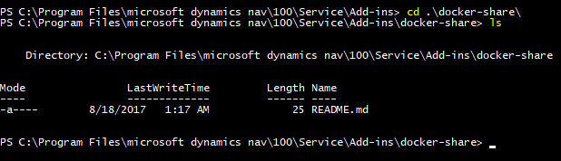

# Examples and use-cases for MS Dynamics NAV on Docker

## SHARE DATA BETWEEN YOUR DOCKER HOST AND A CONTAINER.

Sharing data between a *Docker host* and containers can be achieved using [Docker Volumes](https://docs.docker.com/engine/admin/volumes/volumes/). We can use this approach for several things like sharing data (data persistance - in case you host your SQL db in a container), scripts or add-ins.

Will demonstrate the technology in the following example where we will share a folder with *add-ins*.

You can see there is a folder called **Add-ins** in the same folder the file `run.ps1` is being located. And we want to share this folder.

### Specific `docker run` parameters in the example are:

- ` -v $PSScriptRoot\Add-ins:"C:\Program Files\Microsoft Dynamics NAV\$navVersionDir\Service\Add-ins\Docker-Share"` - Required in this example. Specifies the definition of the Docker mount.  
On the left side you configure the host folder (**this MUST exist**).  
On the right side you specify the folder in the container (**this MUST NOT exist** as it **will be created automatically**).  
You can see we use `$PSScriptRoot` on the host to adjust the absolute path. 
On the container\`s part we use `$navVersionDir` variable that is being assigned on the beginning of the script. This actually sets automatically the NAV version folder. You can replace it manually (in case of NAV 2017 you have to set **100**).

    ```PowerShell
    -v host_path:container_path
    # A simple example (host:container)
    -v c:\docker\share:c:\global_share
    ```


---

## The result of the `run.ps1` script:

We can validate that the folder we specified before has been created in the container and that any changes propagates in both directions.

- Let\`s enter the container:
    ```PowerShell
    # Run the following on the docker host:
    docker exec -it navex-share-mount-addins powershell
    ```

- Run the following in the container to validate that everything works correctly:
    ```PowerShell
    # Go to the "add-ins" folder (the path is version-based!!!):
    cd '.\Program Files\microsoft dynamics nav\100\Service\Add-ins\'

    # Find the folder (we know that the name contains 'docker' substring):
    ls *dock*
    ```

    

    ```PowerShell
    # Enter the shared folder:
    cd .\docker-share\

    # Show the content of the folder:
    ls
    ```

    You should be able to see all files you can see on the host (in my case I can see `README.md` file, this is OK).

    


    