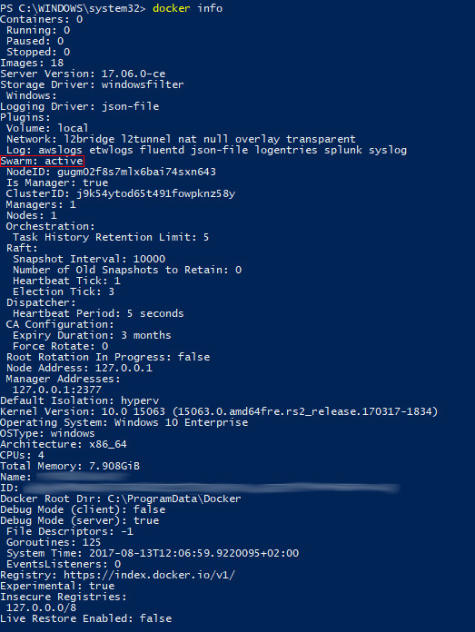
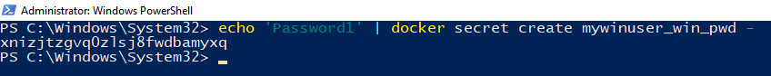
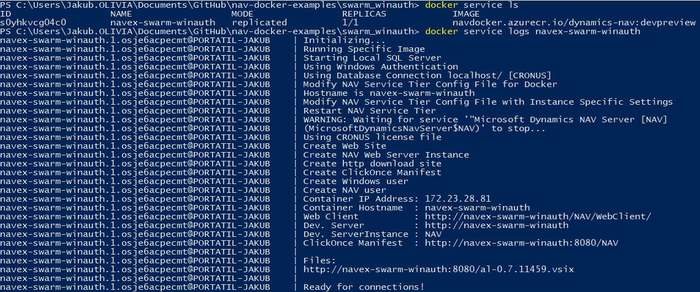
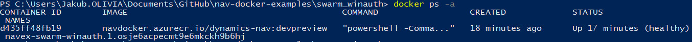
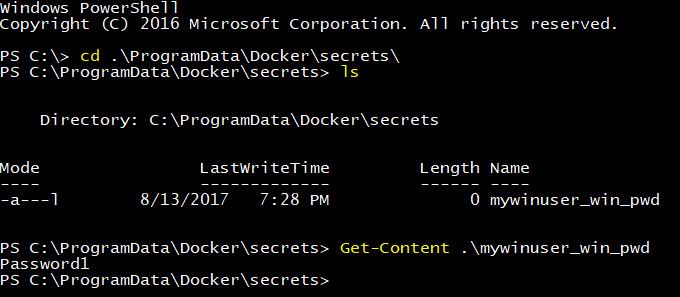
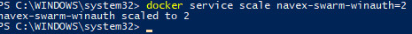

# Examples and use-cases for MS Dynamics NAV on Docker

## WINDOWS AUTHENTICATION ON DOCKER SWARM (USING DOCKER SECRETS)

**Note:** Docker 17.06 or higher is required.

This example guide you through the Docker Swarm initialization process. Next we will use [Docker Secrets](https://docs.docker.com/engine/swarm/secrets/) to securely store our password in a strongly encrypted storage provided by Docker. And in the last step we will create a [Docker Service](https://docs.docker.com/engine/reference/commandline/service_create/) that will consume previously created password and will use it in the derived container to complete windows account credentials of your Windows user.

**Note:** What **Docker Service** concept means and how does it work can be seen here: [How services work](https://docs.docker.com/engine/swarm/how-swarm-mode-works/services/).

### Init Docker Swarm

**Note:** You can skip this step in case you are already running Docker Swarm (version 17.06) and have access to the manager node.

I will promote my local Win10 on Docker Swarm Manager node. I am considering this step only for testing purposes so I won\`t any other nodes to be added into the swarm. In this case I will **advertise** my node using the **loopback interface**:

```
docker swarm init --advertise-addr=127.0.0.1
```

**Note:** In case you expect another nodes will be added you should probably use a static IP address to advertise your node.

Now you can run `docker info`. You should be able to see you are running an active swarm node:




### Set your password as a Docker Secret

This step is very simple. You modify and run the following command:

```
echo '[my_win_pwd]' | docker secret create mywinuser_win_pwd -
```

- `[my_win_pwd]` - Change this dummy value and put your real password.

- `mywinuser_win_pwd` - You can keep this value as it is. In this case this will work using the `run.ps1` example. If you change the value, you should change also `-e secretPassword=mywinuser_win_pwd` and `--secret=mywinuser_win_pwd`. The right side has to match the new value. This value simply work as *a pointer* to the secure storage where the secrets are being stored in.

And in the following screenshot you can see how simple it really is:




### Specific `docker service create` parameters in the example are:

- `--secret=mywinuser_win_pwd` - Specify secret identifier. This secret will be shared in a unencrypted form with the container. Docker Swarm Engine will create (by default) `mywinuser_win_pwd` fie in `C:\ProgramData\docker\secrets`. This file - `C:\ProgramData\docker\secrets\mywinuser_win_pwd` - will contain your password. We will consume it later.

- `-e secretPassword=mywinuser_win_pwd` - Assigns the name of the file containing the secret to the environmental variable named `secretPassword`. `mywinuser_win_pwd` here must match `mywinuser_win_pwd` in the `--secret` flag. This parameter could be avoided in some circumstances (will be explained bellow).

- `--mount type=bind,source=$PSScriptRoot\my,destination=c:\run\my` - Share our local **my** sub-folder with the container created by the docker service. You can see there is a file in the folder. `SetupVariables.ps1` is just an override we will use to read the password passed by the engine into the container.

    ```PowerShell
    # Invoke default behavior
    . (Join-Path $runPath $MyInvocation.MyCommand.Name)

    if (!([System.String]::IsNullOrEmpty($env:secretPassword))) {
        $password = Get-Content(Join-Path 'C:\ProgramData\docker\secrets' $env:secretPassword)
        Remove-Item (Join-Path 'C:\ProgramData\docker\secrets' $env:secretPassword) -Force
    }
    ```

    - When I have mentioned we could avoid some sort of duplicity presented by the second parameter (`-e secretPassword=mywinuser_win_pwd`) I was actually pointing to `SetupVariables.ps1` file.

    - You could simply adjust you `SetupVariables.ps1` and change the logic to avoid using `$env:secretPassword`. Instead, you should define a fixed name of the secret being used by the script. Simply said - you should always use `--secret=mywinuser_win_pwd` (regards my current definitions). 
    
    - I can imagine this for could be used for storing your/*single* WinAccount pwd on your *single node local cluster* but won\`t be acceptable in a multi-user environment (where you need to define multiple password etc. and so need to define multiple secret identifier).

    - My current solution flexible (the positive aspect) in cost of some sort *duplicity* (the negative aspect).

    **Note:** You can read about the *Mounts* [here](https://docs.docker.com/engine/reference/commandline/service_create/#add-bind-mounts-or-volumes).

- `-e username=MyWinUser` - **Set your Windows account!!!** Don\`t forget to change this value to match your own credential (eg: `-e username=Jakub` in my particular case).

**Note:** You can see I override the **health check** parameters. I had to change them because the containers were starting a bit slower than expected by the internal health check definitions. You can keep them as they are right now or you can do some changes (change/remove my overrides or even disable **health checks** completely using `--no-healthcheck`).


## The output of the `run.ps1` script:

**Nothe:** Please, be patient and wait some time. The service need to do some work (schedule a task, create a container etc.). It is possible you will see for some specific time (one, two or three minutes **0/1 REPLICAS** but this should change after some short period).

In this case we want to list **running services** using `docker service ls` rather then listing running containers (however this is possible as well). We are going to check the logs in the same manner, against the service we have created using `docker service logs [service_name]` (in our particular example you can run `docker service logs navex-swarm-winauth`). And the output of the both command can be seen in the following screenshot:



As I have already mentioned, you can see list the containers as well as the service actually creates containers as well. The names of the containers won\`t exactly match the service name, instead they will contain the name of the service + some postfix added by Docker Swarm engine.

Let\`s run `docker ps -a` command:



If you want to work with the container somehow (to see the logs of a specific container only) you need to reference the compounded name you can see in the previous screenshot. We will use this approach practically in the next section.


## Access the container to confirm the theory about the secrets:

**Note:** To be able to pass through the *verification process* described in this section you will need adjust the script `.\my\SetupVariables.ps1"` like this (remove the line where I delete the secret file from the disk to enhance even more the security aspect):

```PowerShell
# Invoke default behavior
. (Join-Path $runPath $MyInvocation.MyCommand.Name)

if (!([System.String]::IsNullOrEmpty($env:secretPassword))) {
    $password = Get-Content(Join-Path 'C:\ProgramData\docker\secrets' $env:secretPassword)   
    # REMOVE THE FOLLOWING LINE TO BE ABLE VERIFY THE THEORY ABOUT OUR DOCKER SECRET:
    # Remove-Item (Join-Path 'C:\ProgramData\docker\secrets' $env:secretPassword) -Force
}
```


Let\`s use the container name we have seen in the previous step and let\`s access the container using `docker exec` command. This will redirect us into the container and everything we will be running will be executed in the context of the container.

```PowerShell
# navex-swarm-winauth.1.osje6acpecmt9e6mkckh9b6hj is the name of the container
# thas has been created.
docker exec -it navex-swarm-winauth.1.osje6acpecmt9e6mkckh9b6hj powershell
```

Then in the container navigate to `C:\ProgramData\Docker\secrets` path and list the content of the directory. You should be able to see the file `mywinuser_win_pwd` I have mentioned before. You can display its content. All these three steps has been captured on the following screenshot:




## Conclusions:

- You can simply promote your local Docker Engine into the Docker Swarm node using one command.

- You can use Docker on Docker Swarm on your Windows 10 without any troubles because the version **17.06 CE** solves many problems and adds many features that were missing in the previous versions. On the Windows Server 2016 the situation is different as the version **17.06 EE** has not been delivered yet.

- You can use *Docker Secrets* in a simple way to secure your sensitive data being passed into the container. Especially from the docker host perspective (you can see the secrets only from the explicitly defined containers).

- You should control access to your **Docker API**. In this manner nobody can access your containers directly using `docker exec`. Watch [Set Docker Security Group](https://docs.microsoft.com/virtualization/windowscontainers/manage-docker/configure-docker-daemon#set-docker-security-group).
    
    **Note:** You can access your containers from the host using `Enter-PSSession -ContainerId [container_name_or_id]` but each user accessing in this manner is not a container administrators and can\`t access the folders requiring admin privileges.

- You can use Docker Swarm to scale your service across the nodes in a really simple way (**COUNT = count of replicas you want to distribute across the swarm**:
    ```
    docker service scale navex-swarm-winauth=COUNT
    ```
    
